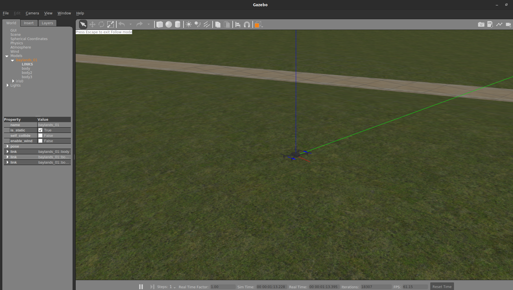
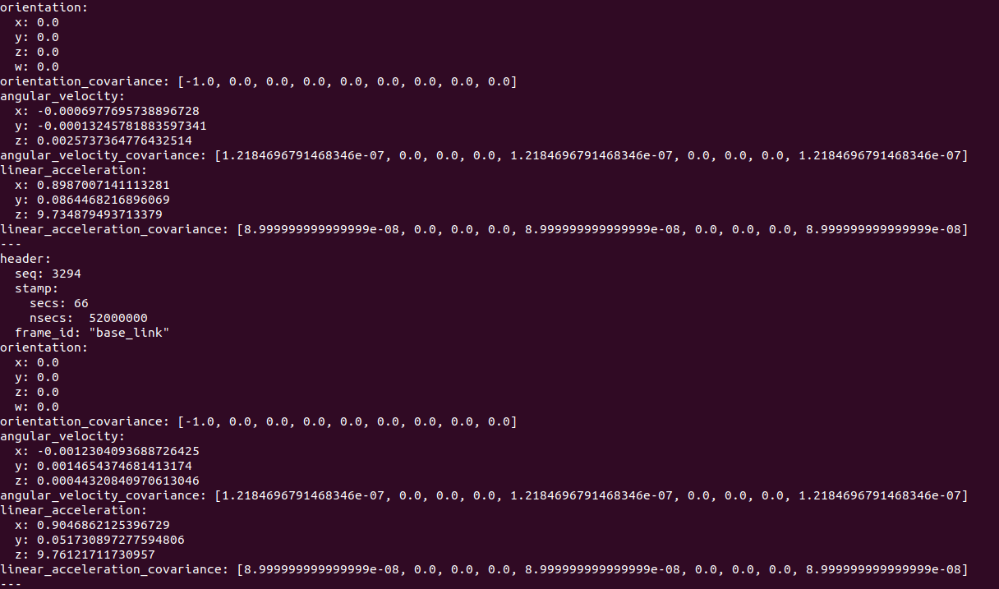
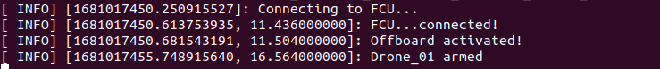
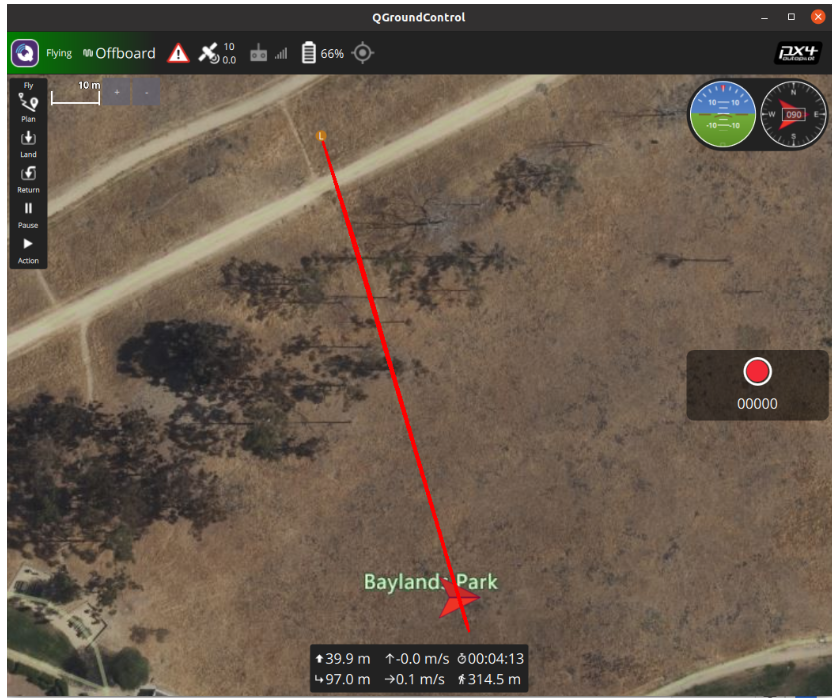
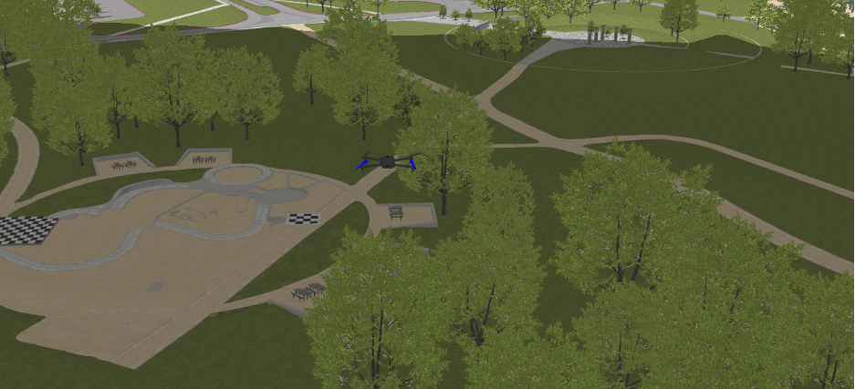
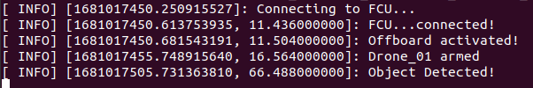
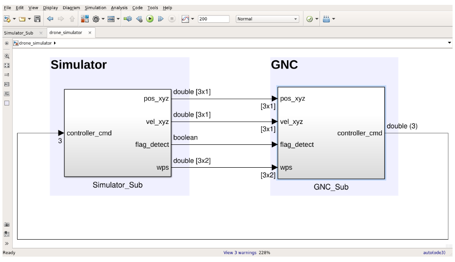
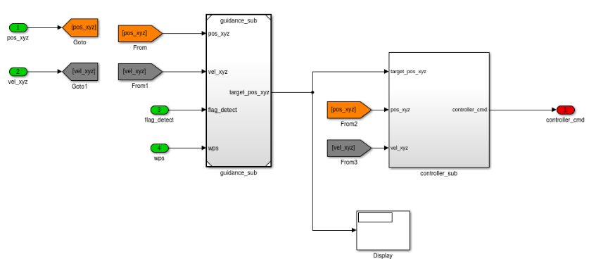
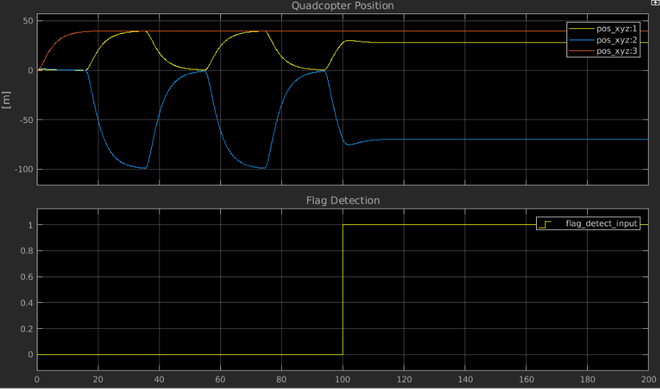

# Drone Control via Matlab  & Simulink in ROS Gazebo
This repository contains the code related to the operation of a quadcopert in a 3D virtual world via a guidance algorithm designed in Simulink and then translated in C++ via autocode generation procedure.
This guidance algorithm will make the quadcopter perform a search between two waypoints and then a simulated detection is assumed after a certain amount of time.
Specifically this repository includes:
 - The Simulink model of the guidance algorithm
 - The ROS node that initialize the 3D simulator
 - The ROS node that contains the C++ code generated via simulink autocode

## Repository Structure

## Simulator setup
The first step (if not done already) is to setup the ROS environment. The instruction on how to setup ROS invironment can be found at this [link](http://wiki.ros.org/ROS/Tutorials/InstallingandConfiguringROSEnvironment).

### Installing dependencies
First let's install mavros by typing
```
sudo apt-get install ros-noetic-mavros ros-noetic-mavros-extras
```
Install the geographic libraries
```
wget https://raw.githubusercontent.com/mavlink/mavros/master/mavros/scripts/install_geographiclib_datasets.sh
sudo bash ./install_geographiclib_datasets.sh   
```

Now you need to download this repository into **~/git_repos** folder. It would make your life easier later.

We now need to link the nodes from the **drone-control-simulink** repository (I am very tired and not a lot of fantasy in choosing names) to our local ROS environment.

The ROS environment is what allows us to compile the code inside the nodes. Usually this code is then compiled and the environment variables are stored in the system. If the environment setting has been deleted it is possible to set it back again using the following steps. Let’s type the following command the the terminal:
```
mkdir -p ~/catkin_ws/src
cd ~/catkin_ws/
catkin build
```
If you don't have this environment setup please follow the instructions at this [link](http://wiki.ros.org/ROS/Tutorials/InstallingandConfiguringROSEnvironment). Please use the same environment as described in the tutorial.

Now download the repository of PX4 from this [link](https://github.com/PX4/PX4-Autopilot) in the **~/git_repos/** folder by typing
```
cd ~/git_repos/
git clone https://github.com/PX4/PX4-Autopilot.git --recursive
```
Also if you don't have the catkin tools installed you can do that by doing
```
sudo apt-get update
sudo apt-get install python3-catkin-tools
```
### Compiling the ROS Nodes
The first step is to link the simulator folder to the **catkin_w** workspace. In order to do this type
```
cd ~/catkin_ws/src
```
now we need to create a symbolic link with the folder containing the drone simulator code. This can be done by typing
```
ln -s ~/git_repos/drone-control-simulink/nodes/flight_simulator/
```
and
```
ln -s ~/git_repos/drone-control-simulink/nodes/px4_simulink_mavros/
```
now type
```
catkin build
```
you should see something like
```
build] Found 2 packages in 0.0 seconds.                                       
[build] Updating package table.                                                
Starting  >>> catkin_tools_prebuild                                            
Finished  <<< catkin_tools_prebuild                [ 1.0 seconds ]             
Starting  >>> flight_simulator                                                 
Starting  >>> px4_simulink_mavros                                              
Finished  <<< flight_simulator                     [ 1.1 seconds ]             
Finished  <<< px4_simulink_mavros                  [ 3.1 seconds ]             
[build] Summary: All 3 packages succeeded!                                     
[build]   Ignored:   None.                                                     
[build]   Warnings:  None.                                                     
[build]   Abandoned: None.                                                     
[build]   Failed:    None.                                                      
[build] Runtime: 4.1 seconds total.                                            
[build] Note: Workspace packages have changed, please re-source setup files to use them.
simone@devpc:~/catkin_ws$
```
## Activating the Simulator Node
First we will activate the simulator node. This step can be done by following the instruction at this [link](https://docs.px4.io/main/en/simulation/ros_interface.html). Where the following commands should be issued:
```
cd ~/git_repos/PX4-Autopilot
DONT_RUN=1 make px4_sitl_default gazebo-classic
source ~/catkin_ws/devel/setup.bash    # (optional)
source Tools/simulation/gazebo-classic/setup_gazebo.bash $(pwd) $(pwd)/build/px4_sitl_default
export ROS_PACKAGE_PATH=$ROS_PACKAGE_PATH:$(pwd)
export ROS_PACKAGE_PATH=$ROS_PACKAGE_PATH:$(pwd)/Tools/simulation/gazebo-classic/sitl_gazebo-classic
```
Furthermore the ground station control software QgroundControl should be launched. The file is located at [link](https://docs.qgroundcontrol.com/master/en/getting_started/download_and_install.html). Now you need to type
```
roslaunch flight_simulator single_quadcopter_baylands.launch
```
now this window should appear . Now a virtual drone connected to a physics engine is running a simulated PX4 firmware and it can commanded via the usual QGroundcontrol interface or can be run via mavros commands. For example, to check the IMU sensor data you can type:
```
rostopic echo /drone_01/mavros/imu/data_raw
```
and the following window should appear:


## Activating the Guidance Node
Now that we have created the ‘guidance node’ we need to run a software-in-the-loop-simulation SIL. In this simulation the input to the code generated by simulink will come from the simulator and the output (the target waypoints) will be sent to the autopilot node that will generate the correct forces and torque to track that specific waypoint.
First make sure that the ***catkin build***  command compiles the node successfully. Now run
```
rosrun px4_simulink_mavros px4_simulink_mavros_node
```
In this case we are not launching a launch file since this has not been created yet. A launch file is just a wrapper that launch a node with a specific set of variables (topics name, node name, remapping etc)

Once the node is initialized the drone will start to patrol between the two waypoints. In the code we have artificially added a flag that simulates the detection of an object. This flag should come from an object detection node when a specific object is detected.  If QGroundcontrol is open you should see the trajectory of the drone on the map as shown below. Furthermore, QGroundcontrol will notify you that the quadcopter has been changed into ‘OFFBOARD’ mode. This mode is essential to be able to control the autopilot (and the quadcopter) from the companion computer. More information about this mode can be found at https://docs.px4.io/main/en/flight_modes/offboard.html

After 55 seconds as specified in the code
```
ros::Duration delta_t(55.0);
```
The quadcopter will stop at that instantaneous location as shown below

For the sake of simplicity, the guidance node will output on the activation terminal a notification that an object has been detected. Specifically, after 55 seconds you should see the notification below


## The Simulink Model
The simulink model is located at this [link](https://github.com/schesi/drone-control-simulink/tree/main/nodes/px4_simulink_mavros/src/matlab_simulink).
This model is composed of two main subsystems. The Simulator_sub (used to simulate the system dynamics) and the GNC_sub (used to generate the control action and the target position). The simulator subsystem (Simulator_Sub) is a simplified model of a 3DOF model. A simple point mass subject to F=ma that can move in three directions. Furthermore, the mass is subject to a viscous friction that is opposite to the point mass motion. In order to display the signals properties and dimensions in the simulink model open the
- Display-> Signals & Ports->Signal Dimensions
- Display-> Signals & Ports->Port Data Types


The inputs and outputs of the Simulator_sub are shown below
***Input***
- Controller_cmd        -     [3,1], double, array representing the controller action (force)

***Output***
- pos_xyz 	- 	[3,1], double, array representing the drone position
- vel_xyz 	- 	[3,1], double, array representing the drone position
- wps 	- 	[3,2], double, matrix representing the waypoints of the patrol area. Each column is a 3x1 waypoint (x,y,z)
- flag_detect 	- 	[1,1], boolean, flag that represents the detection of an object (1=Detected, 0=Not detected)

The guidance navigation and control subsystem (GNC_Sub) provides the control action to the simulator subsystem. The navigation is not performed in this example (it is assumed that the position is always known). The guidance and control is performed by two subsystems inside the GNC_Sub. The two subsystems are shown in the picture below

On the left side is the guidance subsystem (guidance_sub). This subsystem receives as input the position and velocity of the quadcopter, it compares with the required patrol waypoints and determines which waypoint should be the target waypoint. In this example if the position of the quadcopter is closer to WPS1 the quadcopter goes to WPS1. When ||quadcopter position - WPS1 || < threshold the target waypoint changes to WPS2. In the same fashion the guidance node keeps moving the quadcopter between these two waypoints. If flag_detect becomes equal to 1. The guidance set the target_pos_xyz to the quadcopter position at the time of the triggering event. This simulates object detection.
The guidance_sub is the subsystem we are going to generate code from. For this reason this subsystem has been converted to a reference model.
The control subsystem (controller_sub) receives as input the position and velocity of the quadcopter together with the target location. A simple PD controller generates the forces that are sent to the simulator and integrated with the differential equations describing the object of the point mass particle motion (the quadcopter).
Before running the simulink model all the variables need to be initialized. This can be done by typing
```
quad_simulator_init
```
In the Matlab Command Window. The initialization file places all the variables in two structures as shown in the code below. It is strongly recommended to use structures so that all the variables of one subsystem can be differentiated from the variables related to the other subsystems as shown below:
```
clear all;
close all;
%% Init file for simulator
% Simulator parameters
simulator.dt = 1/100;
simulator.x0 = [0,0,0,1,2,-1]';
simulator.flag_detect = timeseries(logical([0 1]),[0 100]);
simulator.wps = [0   40
             	0   -100
             	40   40];

% GNC Sub parameters
gnc_sub.controller.kp = 0.8;
gnc_sub.controller.kd = 4;
gnc_sub.guidance.dt = 1/20; %[hz]
```
We can now run the simulink model and open the scope ‘Monitor’ inside the simulator subsystem.

The top graph shows the drone position. As time passes the drone keeps moving between two waypoints at the same altitude. This can be seen since the x,y position periodically goes back while the z axis converges to a constant value. Once the flag detection goes to 1 the drone goes back to the exact position logged when the flag was triggered. This can be seen by closely inspecting the x,y, position since these values go back at exactly the intersection of 100s.
### How to Generate the Flight Code
The next sections describe the steps required to generate and integrate the code from the simulink model to the ROS Node. The reader should be able to follow the steps in order to create a model, generate the code, inspect the code and wrap the generated code into a simulink model.
...
...
